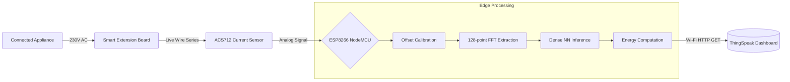

# TinyML Smart Power Strip: Appliance Identification & Energy Monitoring

## Overview
This repository contains the firmware, data processing scripts, and documentation for a TinyML-based intelligent power strip. The system autonomously identifies connected electrical appliances and continuously monitors their energy consumption, transmitting the processed data to a ThingSpeak IoT cloud platform. 

By executing a fully-connected dense neural network directly on a resource-constrained ESP8266 NodeMCU, this project demonstrates that intelligent non-intrusive load monitoring (NILM) can be achieved without relying on a central gateway, heavy edge devices, or cloud inference engines.

## Features
* **On-Device Machine Learning:** Int8-quantized TFLite Micro model deployed natively on an ESP8266.
* **Spectral Feature Extraction:** Computes a 128-point FFT locally to extract harmonic signatures from the AC current waveform.
* **Real-Time Energy Monitoring:** Computes RMS current and apparent power simultaneously with classification.
* **IoT Cloud Integration:** Uploads appliance ID, confidence scores, and power metrics to a ThingSpeak dashboard over Wi-Fi.
* **Frugal Resource Usage:** The inference pipeline executes in ~1 ms and consumes only 1.4 KB of RAM and 15.7 KB of Flash.

## System Architecture

## Hardware Setup
* **Microcontroller:** ESP8266 NodeMCU 1.0 (ESP-12E) running at 80 MHz[cite: 1].  
* **Current Sensor:** ACS712-05B isolated Hall-effect current transducer (185 mV/A sensitivity)[cite: 1].  
* **Physical Interface:** Modified 4-socket Indian-type (BS 546) extension board operating at 230 V AC, 50 Hz[cite: 1].  
* **Data Collection Node:** Arduino UNO (used strictly for stable 500 Hz offline data acquisition due to its stable 10-bit ADC)[cite: 1].  

### Wiring Guide
The ACS712 module is placed in series with the live wire of the extension board[cite: 1]. The analog output of the ACS712 is connected to the `A0` analog pin of the ESP8266[cite: 1]. The sensor is powered via the microcontroller's 3.3V/5V rails.  

## Dataset & Preprocessing
The model was trained to identify five specific load classes spanning 0 W to 1500 W[cite: 1]:
* **No Load** (0 W)[cite: 1]  
* **Phone Charger** (~7.75 W)[cite: 1]  
* **Laptop Charger** (65 W)[cite: 1]  
* **Pedestal Fan** (120 W)[cite: 1]  
* **Electric Kettle** (1500 W)[cite: 1]  

Data was collected at a physical acquisition rate of 500 Hz (2 ms inter-sample delay) using the Arduino UNO[cite: 1]. Python scripts segmented this data into 200-sample non-overlapping windows and applied 1 ms timestamps, mapping the data to a 1000 Hz logical sampling rate[cite: 1]. This dataset totals 75,000 samples per class (1,875 windows)[cite: 1].  

## Model Architecture (Edge Impulse)
* **DSP Block:** Spectral Analysis with a 128-point FFT length, extracting 69 spectral features per window[cite: 1].  
* **Neural Network:**
  * **Input layer:** 69 spectral features[cite: 1]  
  * **Hidden Layer 1:** 20 neurons (ReLU)[cite: 1]  
  * **Hidden Layer 2:** 10 neurons (ReLU)[cite: 1]  
  * **Output Layer:** 5 neurons (Softmax)[cite: 1]  
* **Training:** 50 epochs with auto-tuned Adam optimizer[cite: 1].

## Performance & Results
* **Validation Accuracy:** 91.0%[cite: 1]
* **Real-world Performance:** 100% recall on high-power loads (Fan, Kettle, Laptop) with confidence scores > 0.99[cite: 1].
* **Known Limitations:** Occasional confusion exists between the idle 'No Load' state and a low-power phone charger due to the 10-bit ADC hardware limitation of the ESP8266 producing similar harmonic profiles at very low RMS currents (<50 mA)[cite: 1].

## Installation & Usage
1. Clone this repository: `git clone https://github.com/YOUR_USERNAME/tinyml-smart-power-strip.git`
2. Open the `firmware/deployment/deployment.ino` file in the Arduino IDE or VS Code.
3. Install the exported Edge Impulse library (`Smart_Appliance_Identification_inferencing.zip`) via **Sketch > Include Library > Add .ZIP Library**.
4. Update the Wi-Fi credentials (`ssid`, `password`) and your ThingSpeak `apiKey` in the code.
5. Flash to the ESP8266 NodeMCU.
6. Connect the hardware and open the Serial Monitor (115200 baud) to view real-time inference and upload status.

## Future Scope
* Upgrading to an external 16-bit ADC (e.g., ADS1115) to improve low-current feature resolution[cite: 1].
* Expanding the appliance dataset[cite: 1].
* Implementing HTTPS/TLS for secure IoT telemetry[cite: 1].
* Exploring multi-appliance simultaneous load disaggregation on the edge device[cite: 1].

## Authors & Citation
**Shree Santh B, Kirupashankar Chockkanathan, Padmacharan R, Prapanjan I, Abhishek S**  
*Amrita School of Artificial Intelligence, Coimbatore, Amrita Vishwa Vidyapeetham, India*[cite: 1]

If you use this project or dataset, please refer to the corresponding conference paper[cite: 1].